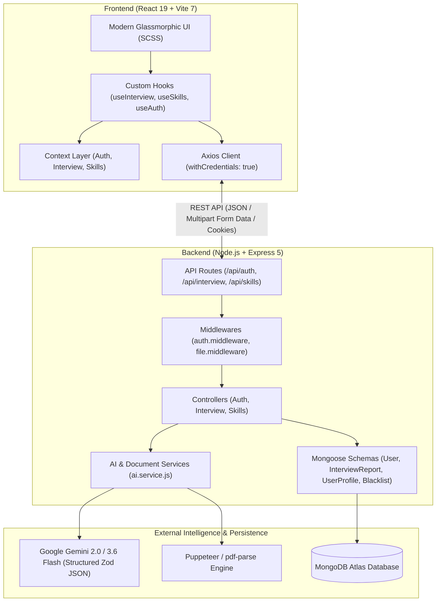
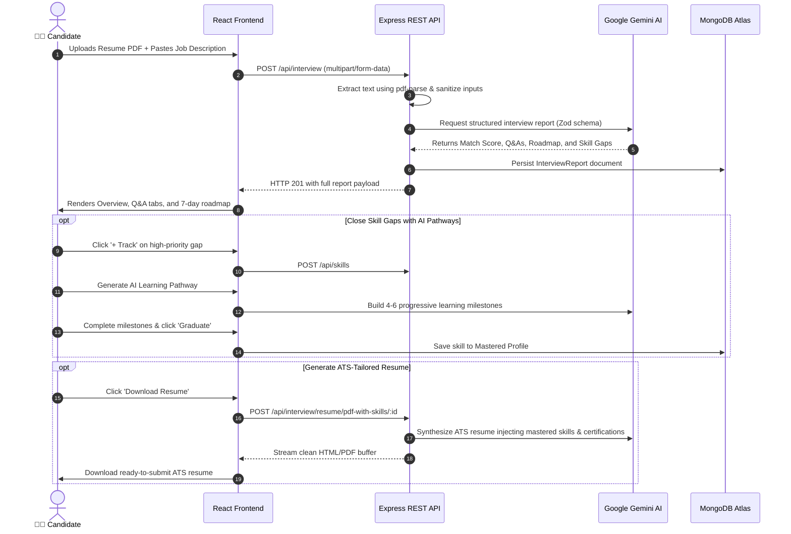

<div align="center">

# ⚡ Interview AI

### *Your Intelligent Career Co-Pilot & GenAI Interview Mastery Platform*

Turn any job description and resume into a high-precision preparation battle plan, predictive question engine, adaptive learning pathway, and ATS-tailored resume — powered by **Google Gemini 2.0 / 3.6 Flash**.

<br/>

[](https://react.dev/)
[](https://vitejs.dev/)
[](https://nodejs.org/)
[](https://expressjs.com/)
[](https://www.mongodb.com/)
[](https://aistudio.google.com/)
[](https://pptr.dev/)
[](LICENSE)

<br/>

[✨ Features](#-core-features) •
[📐 Architecture](#-system-architecture) •
[🔄 User Workflow](#-interactive-user-workflow) •
[⚡ Quick Start](#-quick-start-guide) •
[📡 API Reference](#-rest-api-reference) •
[🗺️ Roadmap](#️-roadmap)

<br/>

---

</div>

## 💡 Why Interview AI?

Traditional interview preparation is broken:
* ❌ **Generic LeetCode / Question Banks**: You spend weeks memorizing arbitrary problems that recruiters for your target position will never ask.
* ❌ **Blind Spot Rejections**: You don't know where your resume falls short against a specific Job Description (JD) until after you get the rejection email.
* ❌ **Unstructured Last-Minute Cramming**: Preparing without a roadmap leads to burnout, stress, and poor retention.
* ❌ **Generic Resumes**: ATS (Applicant Tracking Systems) filter out candidates whose resumes lack keywords matching the specific job role.

**Interview AI changes the game.** By analyzing your real resume against the exact target job description using Google Gemini multimodal intelligence, it generates a custom-tailored preparation blueprint with question intentions, a day-by-day sprint roadmap, a live skill tracker, and an ATS-optimized resume.

<br/>

### 📊 Traditional Prep vs. Interview AI

| Capability | Traditional Prep | ⚡ Interview AI |
| :--- | :---: | :---: |
| **Match Analysis** | Gut feeling / guesswork | **0–100% Precision Match Rating** |
| **Question Relevance** | Generic public question lists | **Role & Experience-Tailored Q&A** |
| **Interviewer Psychology** | None — you guess what they want | **Interviewer Intention + Model Answers** |
| **Preparation Structure** | Chaotic notes & bookmarks | **Structured 7-Day Sprint Roadmap** |
| **Skill Gap Remediation** | Figure it out yourself | **AI Learning Pathways with Checklists** |
| **Resume Optimization** | Static, one-size-fits-all PDF | **ATS-Optimized Resume with Synced Skills** |
| **Progress Persistence** | Disorganized spreadsheets | **Persistent Cloud Skill Tracker & Profile** |

---

## ✨ Core Features

### 🎯 1. Intelligent Job-Resume Match Score (0–100%)
* Upload your resume PDF and paste any target job description.
* Google Gemini parses your work history, technologies, and career trajectory against the employer's requirements.
* Delivers an instant compatibility score with contextual categorization: **Strong Match** (80%+), **Good Match** (60–79%), or **Needs Preparation** (<60%).

### 🧠 2. Dual-Track Predictive Interview Q&As
* **Technical Questions**: In-depth questions testing your domain architecture, coding patterns, framework internals, and system design.
* **Behavioral Questions**: Scenario-based questions examining leadership, conflict resolution, ownership, and agile velocity.
* **The "Intention" Breakdown**: Reveals *why* the interviewer asks each question and what red/green flags they look for.
* **Model Answer Blueprint**: Actionable, structured sample answers following STAR and engineering best practices.

### 🗺️ 3. 7-Day Adaptive Sprint Roadmap
* Breaks down your preparation into a focused, day-by-day syllabus starting from Day 1 to interview day.
* Outlines daily objectives and actionable tasks so you study with purpose, not panic.

### 📊 4. Skill Gap Diagnostics & Live Tracker
* Identifies critical technical omissions categorized by severity: **High**, **Medium**, or **Low** priority.
* One-click **+ Track** adds any gap into your persistent tracker.
* Status cycle workflow: `Not Started` ➔ `In Progress` ➔ `Mastered` with personal scratchpad notes.

### 🧭 5. AI Learning Pathway Generator
* Need to close a skill gap quickly? Trigger the AI Pathway Generator for any technology or topic.
* Generates a 4–6 milestone progressive mastery roadmap with concrete practical tasks.
* Interactive checkboxes allow you to track subtopics, check off milestones, and click **Graduate** to automatically push the skill into your Mastered Career Profile!

### 💼 6. Career Profile & Verified Certifications
* Centralized hub tracking your **Mastered Skills**, **Custom Skills**, and **Accredited Certifications** (issuer, issue date, credential ID, verification URL).
* Persisted securely in MongoDB across your entire interview journey.

### 📄 7. ATS-Optimized Tailored Resume Engine
* Single-click generation of ATS-friendly, clean HTML/PDF resumes.
* Intelligently aligns candidate experience with target job keywords while injecting verified mastered skills and certifications directly into the resume!

### 🌓 8. Sleek Glassmorphic Dual-Theme UI
* Built with custom SCSS design tokens, responsive typography, and fluid micro-animations.
* Instant Dark/Light mode switching with system preference detection and smooth transitions.
* Collapsible quick-launch sidebar drawer for reports, skill tracking, and career profiling.

---

## 📐 System Architecture

Interview AI is built on a **Decoupled Client-Server Monorepo Architecture** designed for high throughput, maintainability, and rapid AI streaming.



---

## 🔄 Interactive User Workflow



---

## 🛠️ Technology Stack

| Domain | Technology | Description |
| :--- | :--- | :--- |
| **Frontend Framework** | **React 19.2** | Latest React with high-performance concurrent rendering |
| **Build Tool** | **Vite 7.3** | Lightning-fast HMR and optimized asset bundling |
| **Routing** | **React Router 7.1** | Modern declarative routing with protected auth guards |
| **Styling** | **Sass (SCSS)** | Glassmorphism, CSS variables, dark/light theme tokens |
| **Backend Runtime** | **Node.js v20+** | Modern asynchronous JavaScript runtime |
| **Web Framework** | **Express 5.2** | Next-generation Express with native async error handling |
| **AI Engine** | **Google Gemini 2.0 / 3.6 Flash** | Low-latency multimodal LLM via `@google/genai` SDK |
| **Schema Validation** | **Zod + zod-to-json-schema** | Guarantees strict, zero-hallucination structured JSON outputs |
| **Database** | **MongoDB Atlas & Mongoose 9** | Flexible NoSQL data layer with automated TTL indexes |
| **PDF Processing** | **pdf-parse & Puppeteer Core** | Server-side PDF text extraction & headless rendering |
| **Security & Auth** | **JWT & bcryptjs** | Stateless signed tokens in `HttpOnly` cookies + blacklist model |

---

## 📁 Repository Structure

```text
interview-ai/
├── Backend/                           # Express 5 REST API Server
│   ├── server.js                      # Server bootstrap & MongoDB startup
│   ├── package.json                   # Backend dependencies & scripts
│   ├── .env.example                   # Template for backend secrets
│   └── src/
│       ├── app.js                     # Express app configuration & middleware pipeline
│       ├── config/
│       │   └── database.js            # MongoDB connection with retry caching
│       ├── controllers/               # Request orchestrators
│       │   ├── auth.controller.js
│       │   ├── interview.controller.js
│       │   └── skill.controller.js
│       ├── middlewares/               # Intercepting middlewares
│       │   ├── auth.middleware.js     # JWT & Blacklist validation
│       │   └── file.middleware.js     # Multer in-memory PDF parsing
│       ├── models/                    # Data schemas
│       │   ├── user.model.js          # User account credentials
│       │   ├── interviewReport.model.js # Structured AI report schemas
│       │   ├── skill.model.js         # Tracked skill gaps
│       │   ├── userProfile.model.js   # Mastered skills, certs & pathways
│       │   └── blacklist.model.js     # Revoked JWT tokens with TTL
│       ├── routes/                    # Clean endpoint definitions
│       │   ├── auth.routes.js         # /api/auth/*
│       │   ├── interview.routes.js    # /api/interview/*
│       │   └── skill.routes.js        # /api/skills/*
│       └── services/                  # Business logic & LLM interfaces
│           └── ai.service.js          # Google Gemini + Zod structured schema engine
│
├── Frontend/                          # React 19 + Vite SPA
│   ├── index.html                     # Application entry HTML
│   ├── vite.config.js                 # Vite bundler configuration
│   ├── package.json                   # Frontend dependencies & scripts
│   ├── .env.example                   # Template for frontend environment variables
│   └── src/
│       ├── main.jsx                   # React DOM root render
│       ├── App.jsx                    # Context providers & router wrapper
│       ├── app.routes.jsx             # React Router configuration with Auth Guard
│       ├── components/                # Global UI components
│       │   ├── AppLayout.jsx          # Shell with header, sidebar & theme toggle
│       │   ├── Sidebar.jsx            # Dynamic drawer for reports & navigation
│       │   ├── SkillTracker.jsx       # 3-in-1 Tracker, AI Pathway & Profile Drawer
│       │   └── ThemeToggle.jsx        # Dark/Light mode toggle switch
│       ├── features/                  # Feature-Sliced Architecture
│       │   ├── auth/                  # Login, Register & Protected Route Guard
│       │   ├── interview/             # Home (Submission) & Interview Plan Viewer
│       │   └── skills/                # Skill context & hooks
│       └── style/                     # Global SCSS variables, reset & layout tokens
│
└── ARCHITECTURE.md                    # Deep-dive engineering blueprint & patterns
```

---

## ⚡ Quick Start Guide

Follow these steps to run Interview AI locally in under 3 minutes.

### 📋 Prerequisites
* **Node.js**: v18.0.0 or higher ([Download](https://nodejs.org/))
* **MongoDB**: A local instance or a free [MongoDB Atlas](https://www.mongodb.com/atlas) cluster
* **Google Gemini API Key**: Free API key from [Google AI Studio](https://aistudio.google.com/)

---

### 1️⃣ Clone the Repository
```bash
git clone https://github.com/anikethana2109-maker/interview-ai.git
cd interview-ai
```

---

### 2️⃣ Configure Backend
Navigate to the `Backend` directory and install dependencies:
```bash
cd Backend
npm install
```

Create your `.env` file based on the template:
```bash
cp .env.example .env
```

Populate the values inside `Backend/.env`:
```env
PORT=3000
MONGO_URI=mongodb+srv://<username>:<password>@cluster.mongodb.net/interview-ai?retryWrites=true&w=majority
JWT_SECRET=your_super_secret_jwt_key_here
GOOGLE_GENAI_API_KEY=your_google_gemini_api_key_here
```

Start the backend server:
```bash
# For development with nodemon hot-reload:
npm run dev

# Or for standard Node startup:
npm start
# Server will run on http://localhost:3000
```

---

### 3️⃣ Configure Frontend
Open a new terminal, navigate to the `Frontend` directory, and install dependencies:
```bash
cd Frontend
npm install
```

Create your `.env` file based on the template:
```bash
cp .env.example .env
```

Populate the values inside `Frontend/.env`:
```env
VITE_API_BASE_URL=http://localhost:3000
```

Start the Vite development server:
```bash
npm run dev
# Frontend will be live on http://localhost:5173
```

Visit **`http://localhost:5173`** in your browser, create an account, and experience Interview AI! 🎉

---

## 📡 REST API Reference

All protected endpoints require an active JWT session cookie established via login.

<details>
<summary>🔐 <strong>Authentication Endpoints (/api/auth)</strong></summary>

<br/>

| Method | Endpoint | Access | Description |
| :--- | :--- | :--- | :--- |
| `POST` | `/api/auth/register` | Public | Register a new user account |
| `POST` | `/api/auth/login` | Public | Authenticate user & set `HttpOnly` JWT cookie |
| `GET` | `/api/auth/logout` | Public | Clear cookie & blacklist token in MongoDB |
| `GET` | `/api/auth/get-me` | Private | Retrieve authenticated user profile |

</details>

<details>
<summary>🎯 <strong>Interview & Resume Endpoints (/api/interview)</strong></summary>

<br/>

| Method | Endpoint | Access | Description |
| :--- | :--- | :--- | :--- |
| `POST` | `/api/interview/` | Private | Generate new interview report from Resume PDF & JD |
| `GET` | `/api/interview/` | Private | Get list of all interview reports for logged-in user |
| `GET` | `/api/interview/report/:interviewId` | Private | Fetch full interview report details by ID |
| `POST` | `/api/interview/resume/pdf/:interviewReportId` | Private | Generate tailored ATS resume HTML/PDF |
| `POST` | `/api/interview/resume/pdf-with-skills/:interviewReportId` | Private | Generate ATS resume with mastered profile skills injected |

</details>

<details>
<summary>📊 <strong>Skill Tracker, Pathways & Profile (/api/skills)</strong></summary>

<br/>

| Method | Endpoint | Access | Description |
| :--- | :--- | :--- | :--- |
| `GET` | `/api/skills/` | Private | Get all tracked skills with status & notes |
| `POST` | `/api/skills/` | Private | Add a skill gap to tracker |
| `PATCH` | `/api/skills/:skillId` | Private | Update skill status (`not-started`, `in-progress`, `mastered`) or notes |
| `DELETE` | `/api/skills/:skillId` | Private | Remove a skill from tracker |
| `GET` | `/api/skills/full-profile` | Private | Fetch full user profile (mastered skills, custom skills, certs) |
| `POST` | `/api/skills/:skillId/save-to-profile` | Private | Save mastered tracked skill to user career profile |
| `GET` | `/api/skills/custom` | Private | List custom user-defined skills |
| `POST` | `/api/skills/custom` | Private | Add new custom skill to profile |
| `DELETE` | `/api/skills/custom` | Private | Delete custom skill from profile |
| `GET` | `/api/skills/certifications` | Private | Fetch user's verified certifications |
| `POST` | `/api/skills/certifications` | Private | Add new certification (issuer, date, credential ID/URL) |
| `DELETE` | `/api/skills/certifications/:certId` | Private | Remove certification from profile |
| `GET` | `/api/skills/pathways` | Private | Retrieve active AI learning pathways |
| `POST` | `/api/skills/pathways` | Private | Generate new AI learning pathway with Gemini |
| `PATCH` | `/api/skills/pathways/:pathwayId/subtopic/:index` | Private | Toggle completion of a pathway milestone |
| `POST` | `/api/skills/pathways/:pathwayId/graduate` | Private | Graduate completed pathway into mastered skills |
| `DELETE` | `/api/skills/pathways/:pathwayId` | Private | Delete learning pathway |

</details>

---

## 🔒 Security & Best Practices

* 🛡️ **HttpOnly Cookie Authentication**: Prevents Cross-Site Scripting (XSS) attacks by keeping session tokens out of JavaScript `localStorage`.
* ⏱️ **MongoDB TTL Blacklist**: When a user logs out, the JWT is immediately blacklisted in MongoDB with a Time-To-Live expiration matching the token's lifetime.
* 🔒 **Zero-Leakage AI Pipelines**: Prompts enforce strict Zod schemas with JSON MIME output, completely eliminating prompt injections and invalid output formatting.
* 📦 **In-Memory File Parsing**: Uploaded PDF resumes are parsed in memory via Multer memory storage and never persisted on disk, safeguarding candidate privacy.

---

## 🗺️ Roadmap

- [x] **Match Score Engine** (0-100% precision fit analysis)
- [x] **Predictive Technical & Behavioral Q&As** with Interviewer Intentions
- [x] **7-Day Sprint Preparation Roadmap**
- [x] **Skill Gap Diagnostics** with High/Med/Low severity tags
- [x] **AI Learning Pathway Generator** with progressive milestones
- [x] **Interactive Career Profile** with Certifications & Mastered Skills
- [x] **ATS-Optimized Tailored Resume Export** with skill synchronization
- [x] **Glassmorphic Dual-Theme UI** (Dark & Light mode)
- [ ] **Voice Mock Interview Simulation** (Real-time speech-to-text with Gemini Audio)
- [ ] **Video Interview Body Language & Eye-Contact Analysis**
- [ ] **Automated Coding Sandbox** for live technical question execution
- [ ] **LinkedIn Profile One-Click Import**

---

## 🤝 Contributing

Contributions make the open-source community an inspiring place to learn, create, and build! Any contributions you make are **greatly appreciated**.

1. **Fork the Project**
2. **Create your Feature Branch** (`git checkout -b feature/AmazingFeature`)
3. **Commit your Changes** (`git commit -m 'feat: add amazing feature'`)
4. **Push to the Branch** (`git push origin feature/AmazingFeature`)
5. **Open a Pull Request**

---

## 📄 License

Distributed under the **MIT License**. See [`LICENSE`](LICENSE) for more information.

---

<div align="center">

Made with ❤️ by [Anikethana](https://github.com/anikethana2109-maker)

*If Interview AI helps you crack your dream job, give it a ⭐ on GitHub!*

</div>
